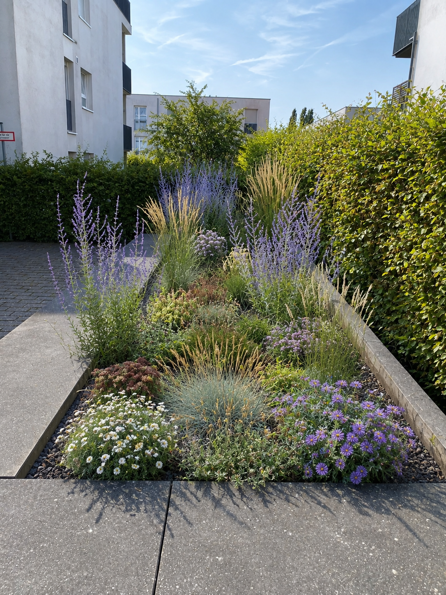
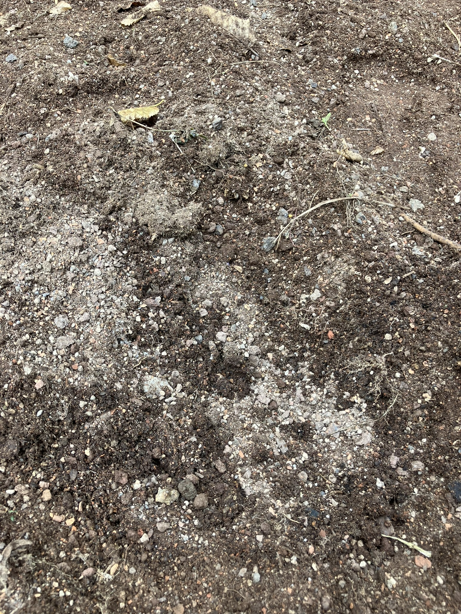
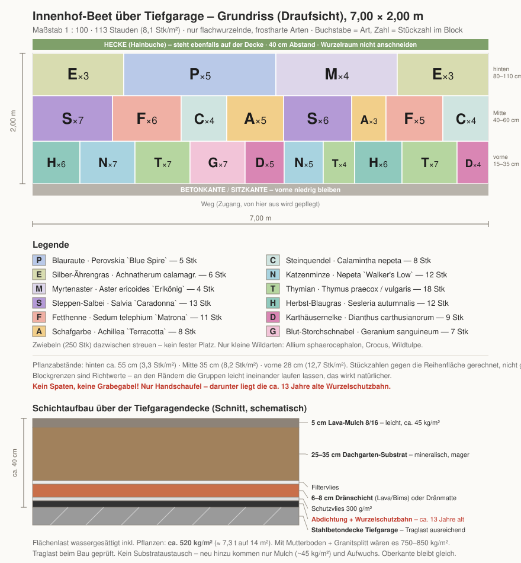
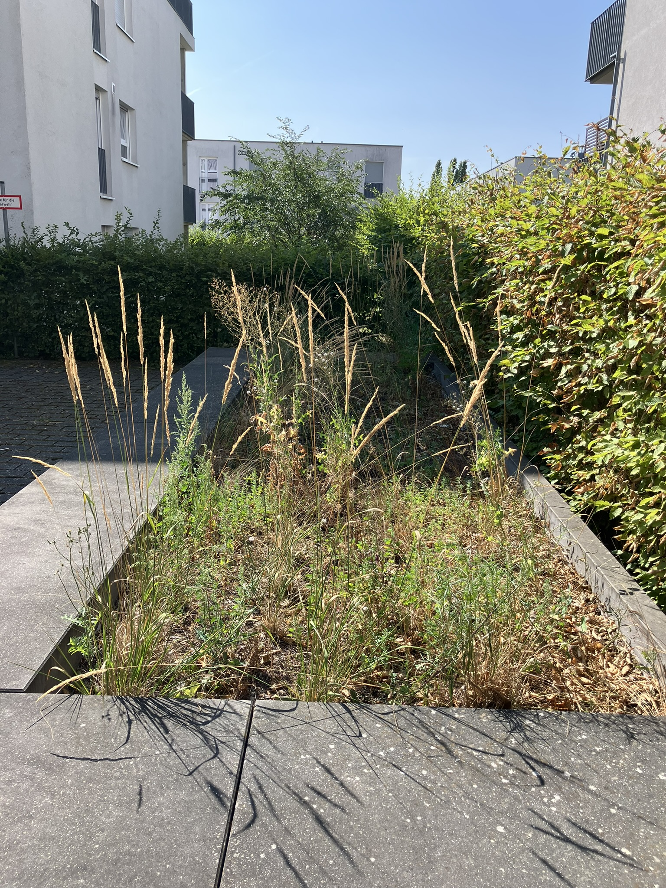

# Pflanz- und Pflegeplan Innenhof-Beet über Tiefgarage (ca. 2 × 7 m = 14 m²)

Konzept: **Steppen-/Präriebeet**, ausgelegt auf die Bedingungen einer Tiefgaragendecke: begrenzter Wurzelraum, keine Anbindung ans Grundwasser, Frost von allen Seiten, empfindliche Abdichtung darunter.

Ziel: **ein einziger Pflichtschnitt pro Jahr** und minimale Pflege. Gießfrei wird das Beet allerdings nie — auch nicht nach Jahren. Siehe [Abschnitt 7](#7-bewässerung--der-kritischste-punkt-im-ganzen-plan).

Wie das Beet am Ende aussehen soll, zeigt der maßstäbliche [Grundriss mit Blockeinteilung, Legende und Schichtaufbau](#grundriss-draufsicht-blockeinteilung) in Abschnitt 3.

Generierte Zielansicht — als Stimmungsbild für die Nachbarschaft gedacht, nicht als Pflanzliste. Drei Einschränkungen dazu:

- Gezeigt ist **Spätsommer/Herbst im 2.–3. Standjahr**. Im ersten Jahr stehen zwischen den Gruppen sichtbare Lücken mit blankem Mulch. Das ist beabsichtigt (siehe Pflanzdichte in [Abschnitt 3](#3-pflanzplan)), wirkt neben diesem Bild aber ernüchternd.
- Der Mulch im Bild ist heller Rundkies. Vorgesehen ist **Lava 8/16**: dunkelrotbraun bis anthrazit und scharfkantig. Das Beet wirkt damit ruhiger, die Blütenfarben stehen kräftiger davor.
- Die Arten stimmen nicht wörtlich: im Bild sind weiße Margeriten und Blauschwingel zu sehen, während Salvia `Caradonna`, Nepeta und Calamintha fehlen — die blühen zum abgebildeten Zeitpunkt schlicht nicht mehr.

---

## 0. Die Rahmenbedingungen — Kurzfassung

| Thema | Vorgabe für dieses Beet |
|---|---|
| **Genehmigung** | **Pflicht.** Schriftliche Freigabe von WEG/Hausverwaltung, vorher Deckenaufbau erfragen |
| **Werkzeug** | **Nur Handschaufel.** Ein Spatenstich in die Abdichtung kostet fünfstellig |
| **Substrat** | Mineralisches Dachgarten-Substrat, mager und **leicht** |
| **Substrattiefe** | **Gemessen: ca. 38–40 cm** bis zur Decke — Zielfall aus Abschnitt 1 trifft zu |
| **Mulch** | **Lava 8/16** — halbes Gewicht von Granitsplitt, gleiche Wirkung |
| **Wurzeltyp** | Nur flach- bis mittelwurzelnde Arten — Pfahlwurzeln finden keinen Platz |
| **Frosthärte** | Der Ballen friert durch → nur voll winterharte Arten |
| **Gießen** | **Dauerhaft 3–6× pro Sommer**, Wasseranschluss nötig |
| **Düngen** | **Alle 2 Jahre schwach** — mineralisches Substrat läuft leer |
| **Unkraut** | Nur Sämlinge von oben, keine Quecke/Winde/Distel aus dem Untergrund — der angenehme Nebeneffekt der Lage |
| **Entwässerung** | Gullys/Notüberläufe **freihalten**, Substrat darf nicht einschlämmen |

---

## 1. Vorab klären — bevor irgendetwas gekauft wird

Diese vier Punkte entscheiden, ob der Plan so umsetzbar ist. Alle vier gehen über die Hausverwaltung.

| Frage | Warum | Wo nachfragen |
|---|---|---|
| **Wie hoch ist der Aufbau über der Decke?** | Bestimmt, welche Pflanzen gehen (Tabelle unten) | Aufbauplan/Dachgutachten bei der Verwaltung; sonst vorsichtig sondieren |
| **Wie alt ist die Abdichtung, ist eine Wurzelschutzbahn drin?** | Ohne FLL-geprüften Wurzelschutz keine Neupflanzung. Abdichtungen halten 30–40 Jahre | Verwaltung / Bauakte / letzte Dachsanierung |
| **Wie viel Traglast hat die Decke noch frei?** | Aufbau + Wasser + Verkehr summiert sich (siehe Abschnitt 2) | Statiker oder Bestandsunterlagen |
| **Wo liegen Gullys, Kontrollschächte, Notüberläufe?** | Müssen dauerhaft zugänglich und frei bleiben | Vor Ort suchen + Plan |

**Aufbauhöhe selbst prüfen — vorsichtig.** Kein Metallstab, kein Spaten. Ein stumpfer Holz- oder Kunststoffstab am Beetrand langsam eindrücken und beim ersten festen Widerstand **stoppen**. Das gibt einen Anhaltswert, ersetzt aber die Unterlagen nicht.

**Ergebnis der Messung:** ca. 40 cm, an einer Stelle 38 cm. Damit ist die Stichprobe erfolgt — die Unterlagen bei der Verwaltung ersetzt das trotzdem nicht, weil der Stab nur die oberste feste Schicht meldet und nichts über Abdichtung, Wurzelschutz oder Resttraglast aussagt.

Blick auf das vorhandene Substrat. Die helle, kantige Körnung zwischen der dunkleren Feinerde spricht für ein bereits mineralisches Dachgarten-Substrat (Splitt/Lava-Anteil) und nicht für reine Muttererde — siehe die Einordnung dazu in [Abschnitt 2](#2-schichtaufbau-und-gewicht).

**Die Hecke ist der beste kostenlose Indikator.** Eine Hainbuche in der Größe der Bestandshecke steht nicht auf 20 cm Aufbau. Das macht den ungünstigsten Fall unten unwahrscheinlich — **aber nur, wenn sie wirklich im selben Aufbau wurzelt** und nicht knapp außerhalb der Deckenkante steht. Genau das beim Verwaltungstermin gezielt fragen; die Unterlagen ersetzt die Beobachtung nicht.

### Was bei welcher Substrattiefe geht

| Substrattiefe | Konsequenz für diesen Plan |
|---|---|
| **< 20 cm** | Staudenbeet nicht möglich. Nur extensive Sedum-Kräuter-Matte. Dieser Plan ist nicht anwendbar. |
| **20–30 cm** | Eingeschränkt: **Reihe A entfällt** (Perovskia + Aster brauchen mehr). Reihen B und C über die ganze Fläche ziehen, Höhe max. 60 cm. Silber-Ährengras als höchstes Element. |
| **30–40 cm** | **Zielfall dieses Plans — hier gemessen (38–40 cm).** Alles wie beschrieben umsetzbar. |
| **> 40 cm** | Komfortabel. Optional *Calamagrostis* × *acutiflora* `Karl Foerster` (5 Stk) als vertikaler Akzent hinten. Gießbedarf sinkt spürbar. |

**Damit ist der Zielfall bestätigt** — Reihe A mit Perovskia und Aster (Abschnitt 3) ist ohne Einschränkung umsetzbar. Weil an einer Stelle nur 38 cm gemessen wurden, wird konservativ mit dem Zielfall gerechnet, nicht mit dem Komfortfall. Wer beim Pflanzen an einzelnen Stellen sicher > 40 cm feststellt, kann dort optional 2–3 `Karl Foerster` ergänzen — pauschal für die ganze Reihe A aber nicht, solange nicht jede Stelle geprüft ist.

**Kein Rindenmulch.** Nährt Unkraut, hält zu viel Feuchte — und schwemmt in die Entwässerung.

---

## 2. Schichtaufbau und Gewicht

Von unten nach oben (Schnittzeichnung siehe Grafik in [Abschnitt 3](#grundriss-draufsicht-blockeinteilung)):

1. Stahlbetondecke
2. Abdichtung + **Wurzelschutzbahn nach FLL** ← der kritische Punkt
3. Schutzvlies 300 g/m²
4. Dränschicht 6–8 cm Lava/Bims 8/16 oder Dränmatte
5. Filtervlies
6. **25–35 cm Dachgarten-Substrat** (Intensivsubstrat: Bims/Lava/Ziegelsplitt mit 8–12 % Kompost)
7. **5 cm Lava-Mulch 8/16**

### Gewicht, wassergesättigt

| Schicht | Höhe | Last |
|---|---|---|
| Lava-Mulch 8/16 | 5 cm | ~45 kg/m² |
| Dachgarten-Substrat | 30 cm | ~390 kg/m² |
| Dränschicht Lava | 7 cm | ~65 kg/m² |
| Vliese + Bahnen | – | ~5 kg/m² |
| Pflanzenaufwuchs | – | ~15 kg/m² |
| **Summe** | **~42 cm** | **~520 kg/m² ≈ 7,3 t auf 14 m²** |

Zum Vergleich: mit Mutterboden und Granitsplitt-Mulch wären es 750–850 kg/m². **Die Materialwahl ist hier kein Detail, sondern der Unterschied zwischen genehmigungsfähig und nicht.**

**Grundregel: die Oberkante nicht anheben.** Wer auf gleicher Höhe bleibt und nur das Material tauscht, ändert die Last kaum und hat es bei der Verwaltung deutlich leichter. Jede Aufhöhung vorher freigeben lassen.

**Hier ist das leicht einzuhalten:** die Substratoberfläche liegt derzeit rund 15–20 cm unter der Betonoberkante (siehe [Bestandsfoto in Abschnitt 6](#6-pflanzzeitpunkt-und-ablauf)). Selbst der in Schritt 2 beschriebene Austausch der oberen 10–15 cm würde vollständig in den vorhandenen Raum passen — die Oberkante bliebe unverändert und die Last stiege nicht. Diese Zahl vor dem Verwaltungstermin bestätigen und mitbringen; sie nimmt dem Gespräch den kritischsten Punkt.

**Austausch vermutlich gar nicht nötig.** Die [Nahaufnahme des Substrats](#1-vorab-klären--bevor-irgendetwas-gekauft-wird) zeigt eine helle, kantige Körnung (Splitt-/Lava-Anteil) in dunklerer Feinerde — das Erscheinungsbild eines mineralischen Dachgarten-Substrats, nicht von reiner Muttererde. Zusammen mit der gemessenen Tiefe von 38–40 cm spricht das dafür, dass Schritt 2 im Ablauf (Abschnitt 6) auf reines Lockern plus etwas Kompost beim Pflanzen reduziert werden kann, statt die oberen 10–15 cm komplett zu ersetzen. Das senkt sowohl die Last (kein zusätzliches Importmaterial) als auch die Kosten (Abschnitt 9). Eine Fingerprobe reicht meist: fühlt sich das Material krümelig-mineralisch an und zerfällt nicht zu Matsch, ist es geeignet. Bei Zweifel oder sichtbar hohem Grünanteil/Verdichtung hilft eine einfache Bodenprobe.

**Rand zur Entwässerung:** Substrat darf nicht in Gullys einschlämmen. Kiesstreifen (Breite 20–30 cm) oder Kontrollschacht-Aufsatz vor jedem Ablauf, Filtervlies dahinter.

---

## 3. Pflanzplan

Zugang von der Wegseite, hinten die Hecke → **hoch nach hinten, flach nach vorne** (die Betonkante bleibt als Sitzkante nutzbar).

Gesamt ca. **115 Stauden ≈ 8 Stk/m²** — bewusst dichter als im Gartenboden. Dichte Pflanzung beschattet das Substrat, bremst die Austrocknung und schließt die Fläche schneller. In Gruppen von 3–7 Stück pflanzen.

Alle Arten sind flach- bis mittelwurzelnd, voll winterhart und auf Dachbegrünungen erprobt.

### Reihe A – hinten, an der Hecke (Höhe 80–110 cm), 22 Stk

| Pflanze | Stk | Warum | Wikipedia |
|---|---|---|---|
| Blauraute *Perovskia* / *Salvia yangii* `Blue Spire` | 8 | Klassiker der Dachbegrünung, extrem hitzefest, 1× Schnitt im Frühjahr. Braucht ≥ 30 cm | [Silber-Perowskie](https://de.wikipedia.org/wiki/Silber-Perowskie) |
| Silber-Ährengras *Achnatherum calamagrostis* | 9 | Rückt aus der Mitte nach hinten: mit Blüte 80–100 cm, feinwurzelig, sehr langlebig | [Silber-Raugras](https://de.wikipedia.org/wiki/Silber-Raugras) |
| Myrtenaster *Aster (Symphyotrichum) ericoides* `Erlkönig` | 5 | Kein Pfahlwurzler, blüht Sept./Okt. und schließt die Blühlücke im Herbst | [Myrten-Aster](https://de.wikipedia.org/wiki/Myrten-Aster) |

### Reihe B – Mitte (Höhe 40–60 cm), 45 Stk

| Pflanze | Stk | Warum | Wikipedia |
|---|---|---|---|
| Steppen-Salbei *Salvia nemorosa* `Caradonna` | 15 | Wie im Angebot, `Caradonna` ist standfester als `Ostfriesland` | [Hain-Salbei](https://de.wikipedia.org/wiki/Hain-Salbei) |
| Hohe Fetthenne *Sedum telephium* `Matrona` / `Herbstfreude` | 12 | Aus dem Angebot — die beste Pflanze überhaupt für flachen Wurzelraum | [Große Fetthenne](https://de.wikipedia.org/wiki/Gro%C3%9Fe_Fetthenne) |
| Schafgarbe *Achillea* `Terracotta` | 9 | Lange Blüte, im mageren Substrat sogar standfester als im Gartenboden | [Schafgarben](https://de.wikipedia.org/wiki/Schafgarben) (Gattung) |
| Steinquendel *Calamintha nepeta* `Triumphator` | 9 | Blüht Juli–Oktober durch, kippt nie um, Insektenmagnet, absolut trockenheitsfest | [Kleinblütige Bergminze](https://de.wikipedia.org/wiki/Kleinbl%C3%BCtige_Bergminze) |

### Reihe C – vorne, zum Weg (Höhe 15–35 cm), 48 Stk

| Pflanze | Stk | Warum | Wikipedia |
|---|---|---|---|
| Thymian *Thymus praecox* / *vulgaris* | 14 | Immergrün, duftet, im Lava-Mulch in seinem Element | [Frühblühender Thymian](https://de.wikipedia.org/wiki/Fr%C3%BChbl%C3%BChender_Thymian) · [Echter Thymian](https://de.wikipedia.org/wiki/Echter_Thymian) |
| Katzenminze *Nepeta* `Walker's Low` | 12 | Deckt schnell, verdrängt Unkraut, blüht monatelang | [Hybrid-Katzenminze](https://de.wikipedia.org/wiki/Hybrid-Katzenminze) |
| Herbst-Blaugras *Sesleria autumnalis* | 10 | Halbimmergrün, sehr langlebig, eines der besten Dachgräser | [Sesleria autumnalis](https://en.wikipedia.org/wiki/Sesleria_autumnalis) (en) |
| Karthäusernelke *Dianthus carthusianorum* | 6 | Magerrasen-Pflanze, versamt sich moderat und schließt Lücken von selbst | [Karthäusernelke](https://de.wikipedia.org/wiki/Karth%C3%A4usernelke) |
| Blut-Storchschnabel *Geranium sanguineum* var. *striatum* | 6 | Dichter Teppich; bewusst nur eine kleine Gruppe, weil er von allen der durstigste ist | [Blutroter Storchschnabel](https://de.wikipedia.org/wiki/Blutroter_Storchschnabel) |

### Grundriss (Draufsicht, Blockeinteilung)

Maßstäbliche Grafik, Meterangaben von links; Buchstabe = Art, Zahl = Stückzahl im Block (Legende in der Grafik).

Pflanzabstände: hinten ca. 55–65 cm, Mitte 35 cm, vorne 28 cm. Die Blockgrenzen sind Richtwerte — an den Rändern die Gruppen leicht ineinander laufen lassen, das wirkt natürlicher als scharfe Kanten.

**Die trockenste Zone ist der Heckenstreifen.** Dort keine Neupflanzung dicht an die Hainbuche setzen und beim Pflanzen deren Wurzeln nicht durchtrennen — sie steht auf derselben Decke und hat keinen Ausweichraum.

### Zwiebeln (einmalig im Herbst mitstecken, danach null Aufwand)

- 100 × *Allium sphaerocephalon* (Kugellauch, Juni/Juli) — 12 cm tief
- 75 × Wildtulpe *Tulipa tarda* oder *Tulipa bakeri* `Lilac Wonder` (April) — 10 cm tief
- 75 × *Crocus tommasinianus* (Februar/März) — 8 cm tief

Nur kleine Wildarten. **Keine großen Tulpen- oder Narzissenhybriden** — die brauchen 15–20 cm Pflanztiefe und regelmäßige Nährstoffe, beides passt hier nicht. Laub nicht abschneiden, es zieht von selbst ein.

---

## 4. Allergien und Geruch

Keine der 115 Stauden gehört zu den klassischen starken Allergieauslösern (Ambrosia, Beifuß, Birke, Hasel, Erle, Rasengräser in Fläche). Zwei Punkte sind trotzdem erwähnenswert, falls im Hof jemand betroffen ist.

### Pollenallergie

| Pflanze | Familie | Einschätzung |
|---|---|---|
| Silber-Ährengras *Achnatherum calamagrostis* (Reihe A) | Süßgras (Poaceae) | Windbestäubt — Gräserpollen zählen zu den häufigsten Allergiequellen überhaupt. Als Horst gepflanzt deutlich weniger Pollen als eine Rasenfläche, blüht aber sichtbar (Mai/Juni). |
| Herbst-Blaugras *Sesleria autumnalis* (Reihe C) | Süßgras (Poaceae) | Ebenfalls windbestäubt, blüht spät (Herbst) mit vergleichsweise wenig Pollen — grundsätzlich aber dieselbe Allergenfamilie. |

Alle übrigen Arten (Salvia, Sedum, Thymus, Nepeta, Dianthus, Geranium, Allium, Tulipa, Crocus …) sind insektenbestäubt und tragen kaum zur Pollenbelastung in der Luft bei.

### Kontaktallergie / Kreuzreaktion

| Pflanze | Familie | Einschätzung |
|---|---|---|
| Schafgarbe *Achillea* `Terracotta` (Reihe B) | Korbblütler (Asteraceae) | Kontaktdermatitis bei Hautkontakt möglich, va. bei bekannter Beifuß-/Ambrosia-Kreuzallergie. Kein Pollenflugrisiko, da insektenbestäubt. |
| Myrtenaster *Aster ericoides* `Erlkönig` (Reihe A) | Korbblütler (Asteraceae) | Gleiche Familie, gleiche Einschränkung — Risiko nur beim direkten Anfassen/Schneiden. |

### Geruch

Keine der Arten ist für Nachbarschaftsbeschwerden über Gestank typisch (anders als z. B. Buchsbaum). Auffällig sind die stark aromatischen Arten:

- **Katzenminze** *Nepeta* `Walker's Low` (Reihe C, 12 Stk) — Duft selbst meist als angenehm empfunden, aber polarisierend. Wichtiger: **zieht Katzen an**, die sich darin wälzen — in einem Gemeinschaftshof eher ein Thema als der Geruch der Pflanze selbst.
- **Steinquendel** *Calamintha nepeta* (Reihe B, 9 Stk) und **Thymian** *Thymus* (Reihe C, 14 Stk) — kräftig aromatisch (minzig/würzig), praktisch durchgehend als angenehm wahrgenommen.
- **Blauraute** *Perovskia* und **Steppen-Salbei** *Salvia nemorosa* — aromatisches Laub, aber schwach und nur bei Berührung wahrnehmbar.

**Fazit:** kein Grund, Arten aus dem Plan zu streichen. Bei bekannter schwerer Gräserpollenallergie im Hof lohnt es sich, das vorher anzusprechen; bei bestehenden Katzenkonflikten die Nepeta-Gruppe im Hinterkopf behalten.

---

## 5. Abweichungen vom Gärtner-Angebot

| Angebot | Bewertung |
|---|---|
| *Stipa tenuissima* (Federgras), 50 Stk | **Weglassen.** Nur 2–4 Jahre haltbar, versamt sich stark, muss jedes Frühjahr ausgekämmt werden. Ersatz: Achnatherum + Sesleria. Wer die Optik will: max. 10–15 Stück vorne als Akzent. |
| *Salvia nemorosa* `Ostfriesland`, 25 Stk | Gute Wahl, übernommen (`Caradonna` etwas standfester). |
| *Sedum* `Herbstfreude`, 10 Stk | Sehr gute Wahl, übernommen und aufgestockt — über einer Decke die verlässlichste Pflanze im Beet. |
| Pflanzdichte ~6 Stk/m² | Zu locker → offene Substratflächen trocknen aus und veralgen. Auf 8 Stk/m² gehen. |
| Mulch | Im Angebot **nicht enthalten** — und über der Tiefgarage doppelt wichtig (Verdunstungsschutz). Unbedingt ergänzen, als **Lava**, nicht als Granitsplitt. |
| Kugeldistel / Rutenhirse (falls angeboten) | Bei < 40 cm Substrat streichen — Pfahl- bzw. Tiefwurzler. |
| Substrat / Deckenaufbau | Im Angebot vermutlich gar nicht adressiert. **Vor Auftragsvergabe nachfragen**, wer für Abdichtung und Wurzelschutz die Verantwortung übernimmt. |

---

## 6. Pflanzzeitpunkt und Ablauf

**Mitte September bis Anfang Oktober** — etwas früher als im Gartenboden. Über der Decke müssen die Pflanzen vor dem ersten Frost eingewurzelt sein, weil der Ballen im Winter komplett durchfriert. Nach Mitte Oktober lieber auf April/Mai verschieben und den ersten Sommer konsequent gießen.

Ausgangslage. Drei Beobachtungen für den Pflanztag: der Bestand ist im Wesentlichen **ein Reitgras plus Sämlinge** und lässt sich nach Schritt 1 von Hand ziehen — kein Spaten nötig. Die Fläche liegt in **voller Sonne ohne jede Beschattung**, was das Steppenkonzept trägt. Und der **Trockenstress ist schon jetzt sichtbar**: verdorrte Halme, offene Substratstellen, dazu braunes Laub im unteren Drittel der Hainbuche rechts.

Ablauf am Pflanztag (2 Nachbarn, ca. 5–7 h):

1. Altbewuchs mit der Hand ziehen. **Kein Spaten, keine Grabegabel, keine Motorhacke.**
2. Substrat oberflächlich mit dem Kultivator lockern, nicht umgraben. Nach der [Substratprobe](#1-vorab-klären--bevor-irgendetwas-gekauft-wird) reicht das voraussichtlich aus, ggf. etwas Kompost einarbeiten. Nur bei zu fettem oder verdichtetem Altsubstrat obere 10–15 cm abtragen und durch Dachgarten-Substrat ersetzen.
3. Lage der Gullys markieren (Bambusstab), damit sie beim Mulchen nicht verschwinden.
4. Töpfe nach Plan auf der Fläche verteilen, erst dann pflanzen. Pflanzlöcher mit der Handschaufel.
5. Zwiebeln dazwischen stecken (8–12 cm tief).
6. Gründlich einschlämmen — über der Decke reichlich: ca. 30 l/m².
7. Lava-Mulch aufbringen, Abläufe wieder freilegen.

Ist eine Tropfleitung geplant (siehe unten), wird sie **vor dem Mulchen** verlegt.

---

## 7. Bewässerung — der kritischste Punkt im ganzen Plan

Dass das kein theoretisches Risiko ist, zeigt das [Bestandsfoto](#6-pflanzzeitpunkt-und-ablauf): die Hainbuchenhecke steht auf derselben Decke und ist im unteren Drittel bereits braun. Der Wasserengpass ist im Hof also schon eingetreten — die Tropfleitung reagiert darauf, sie beugt nicht nur vor. Genau so gegenüber der Verwaltung argumentieren.

30 cm mineralisches Substrat speichern rund **40–50 l/m² pflanzenverfügbares Wasser**. Ein besetztes Beet verdunstet im Hochsommer 3–5 l/m² pro Tag. Rechnung: **nach 10–14 Tagen ohne Regen ist der Speicher leer** — und darunter kommt nichts nach, weil es keine Anbindung an gewachsenen Boden gibt.

Daraus folgt der Gießrhythmus:

- **Jahr 1:** 1–2× pro Woche durchdringend, ca. 20–25 l/m². Nicht verhandelbar.
- **Jahr 2:** wöchentlich in Trockenphasen.
- **Ab Jahr 3 (etabliert):** realistisch **3–6 Wassergaben pro Sommer**, je 20–25 l/m², jeweils nach ca. 2 Wochen ohne nennenswerten Regen. Das sind pro Gang ca. 300 l für die 14 m².

**300 l mit der Gießkanne sind 30 Gänge.** Deshalb die klare Empfehlung: **Tropfrohr unter dem Mulch verlegen** — ca. 35 lfm bei 30 cm Reihenabstand, angeschlossen an den Außenhahn, mit einfacher Zeitschaltuhr. Kosten ca. 150–250 €. Das ist über einer Tiefgarage keine Bequemlichkeit, sondern der Faktor, an dem solche Beete typischerweise scheitern.

Wenn es keinen Wasseranschluss im Hof gibt: **das zuerst klären, vor der Pflanzenbestellung.**

---

## 8. Pflegekalender

| Zeitpunkt | Maßnahme | Aufwand |
|---|---|---|
| **Mitte – Ende März** | **Der einzige Pflichttermin:** alles bodennah zurückschneiden (Gräser 10 cm, Stauden 5 cm, Perovskia auf 15 cm ins alte Holz). Etwas später als im Gartenboden — die Halme schützen den durchfrierenden Ballen. Schnittgut abfahren. | 2 Pers. × 2 h |
| **April** | Unkraut durchgehen, solange es klein ist. Mulch ergänzen. **Alle 2 Jahre** schwach düngen: 30–40 g/m² organischer Langzeitdünger. Mineralisches Substrat wird ausgewaschen — anders als im Gartenboden ist Nulldüngung hier auf Dauer zu wenig. Nicht mehr geben, sonst werden die Pflanzen weich. | 1,5 h |
| **Mai / Juni** | 1× Unkrautkontrolle. In den ersten 2 Jahren alle 2–3 Wochen. Gullys auf Verstopfung prüfen. | 1 h |
| **Ende Juni (optional)** | Nepeta und Salvia nach der ersten Blüte um ⅓ einkürzen → zweite Blüte im August. Kann man auch weglassen. | 1 h |
| **Juli / August** | **Wässern nach Regel oben** — nicht nach Gefühl. Faustregel: 2 Wochen ohne Regen = gießen, auch bei etabliertem Beet. | 2–4 h/Saison |
| **September / Oktober** | Ausblühen lassen. Lücken nachpflanzen, Zwiebeln ergänzen. Laub aus den Abläufen holen. | 1 h |
| **November – Januar** | **Alles stehen lassen.** Über der Decke doppelt wichtig: die Halme und die Mulchschicht sind die einzige Wärmedämmung, die der Wurzelballen hat. Nur Abläufe nach Laubfall einmal freiräumen. | 0,5 h |

**Realistischer Jahresaufwand ab Jahr 3: ca. 10–15 Stunden** — etwas mehr als im gewachsenen Boden, fast vollständig durch das Gießen. Ohne Tropfleitung eher 20 Stunden.
In den ersten beiden Jahren 25–30 Stunden.

---

## 9. Kosten (Eigenregie, grob)

| Position | Betrag |
|---|---|
| Stauden, 115 Stk (Staudengärtnerei, Sammelbestellung) | 450–650 € |
| Zwiebeln, 250 Stk | ~50 € |
| Lava-Mulch 8/16, ca. 0,8 m³ | 120–200 € |
| Dachgarten-Substrat (Kontingenz, nur falls Bodenprobe doch Austausch nötig macht — nach aktuellem Foto/Messung eher unwahrscheinlich, ca. 2 m³) | 250–400 € |
| Tropfleitung + Zeitschaltuhr | 150–250 € |
| **Summe ohne Substrataustausch** | **~800–1.150 €** |

**Nicht eingerechnet:** Prüfung oder Erneuerung der Abdichtung. Falls die Wurzelschutzbahn fehlt oder die Abdichtung am Ende ihrer Lebensdauer ist, ist das ein Gemeinschaftsthema in ganz anderer Größenordnung — und dann ist das Beet der Anlass, nicht die Ursache.

---

## 10. Organisation in der Nachbarschaft

- **Zuerst die Hausverwaltung, dann die Pflanzenliste.** Deckenaufbau, Traglastreserve, Alter der Abdichtung und schriftliche Freigabe holen. Ohne das keine Bestellung.
- Beim Termin gleich mit abfragen: **Wer haftet, wenn beim Pflanzen etwas beschädigt wird?** In der Regel die Handelnden. Ein GaLaBau-Betrieb mit Dachbegrünungserfahrung bringt eine Betriebshaftpflicht mit — bei unklarer Abdichtungslage ist das die ruhigere Variante als die Nachbarschaftsaktion.
- **Werkzeugregel am Pflanztag laut ansagen:** keine Spaten, keine Grabegabeln, keine Erdbohrer. Alle bringen Handschaufeln mit.
- Feste **Termine im Kalender**: 1× März (Rückschnitt), 1× April, 1× Juni.
- **Gießpate benennen** — dauerhaft, nicht nur für den ersten Sommer. Mit Tropfleitung reduziert sich das auf „Zeitschaltuhr im Blick behalten".
- **Wasseranschluss im Hof** ist hier Voraussetzung, nicht Komfort.
